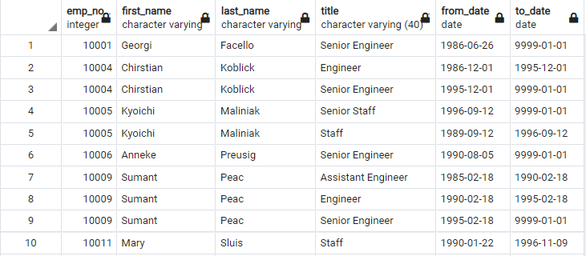
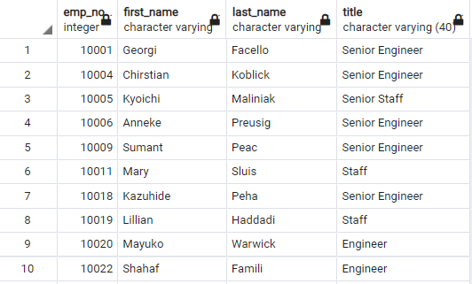
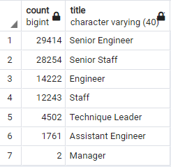
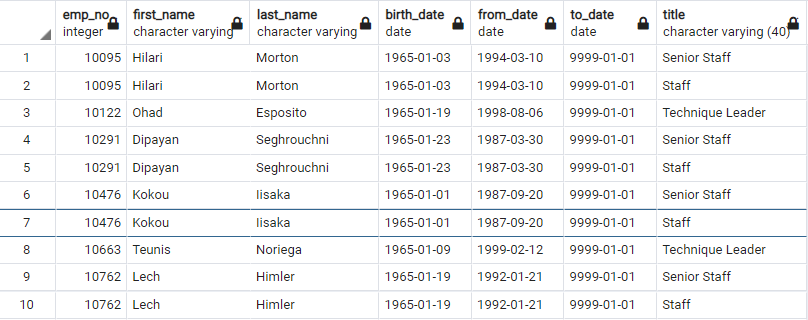
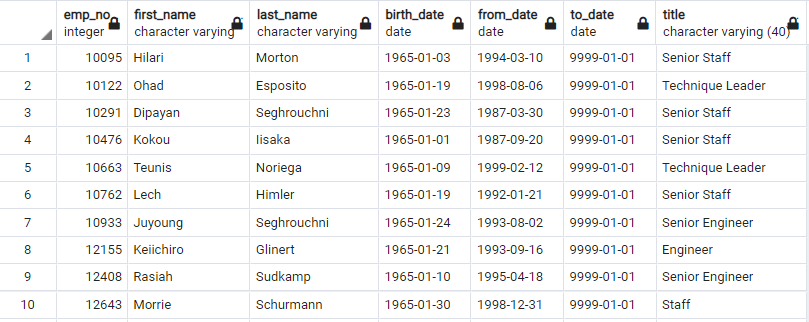

# Pewlett-Hackard-Analysis

## Project Overview
The purpose of this analysis to is assist an established company *Pewlett-Hackard*. PH is a large company, boasting several thousand employees. As baby-boomers begin to retire at a rapid rate, PH is worried about filling specific positions in the future, those which are currently held by soon-to-retire workers.
We are assisting an HR analyst future-proof Pewlett-Hackard by performing employee research - Specifically, we worked to find answers to 

"Who will be retiring in the next few years?" 

"How many positions will PH need to fill?"

Thus, we generated a list of all current PH employees who will soon be eligible for retirement packages. We constructed an employee database with SQL by applying our data modeling, engineering, and analysis skills.

## Resources
- Data Sources: departments.csv, dept_emp.csv, dept_manager.csv, employees.csv, salaries.csv, titles.csv
- Software: pgAdmin 4 - PostgresSQL 11, Visual Studio Code, 1.60.2

## Results
- To begin our analysis, we needed to clean the data. One task that needed my care was ensuring that we had a table of every current employee who is set to retire in the coming few years, and their most recent title at the company in the same row. In doing so, PH would be able to provide retirement packages to their set-to-retire employees through said employees' current departments. We want to avoid mistakes in distributing well-earned retirement packages. By clearing up where each and every employee is currently working, we won't send sensitive information to a department where the employee isn't currently working in.

- Here is a table with all of the prospective retiree's employee numbers, their names, their titles (throughout their careers at PH), and their start and end dates. For the record, their end dates are set as "01-01-9999" to denote the fact that they are still currently working. We needed to fill in a value for their end dates to allow analysis on the data. 

- Now, because we are particularly focused on the employees' *current* titles, where PH will send their retirement packages through, I needed to pinpoint these employees' current working titles. To do this, I used a "SELECT DISTINCT ON" function in SQL from the table above, and specified to group the data by title. Then, in ordering by the end date, I reveal exactly the data we need: each and every employee listed in the table with only their current working title. This way, PH knows exactly which department to deliver their retirement packages through. See the desired data table below:

- Here is a data table comprising the nine different departments of PH and the number of set-to-retire employees in each department.

## Summary
90,398 employees will be retiring in PH's "silver tsunami". The question is, will that be enough employees to train the oncoming wave of prospective senior-role employees right behind them?

Thankfully, there is a plan to set up a program in place to help with retiring turnover and the loss of experienced workers from Pewlett-Hackard. The idea is that retiring employees will be able to shift their experience and learning onto the wave of workers right behind them - Those who will be filling in the retiring employees' senior roles. So, we sought to procure a table composed of workers eligible to enter this mentorship program, who will learn from the soon-to-retire employees.

Similar to our multiply-titled-workers issue from earlier, we needed to develop a data table which delivers the above data, but only delivers one row of information for each worker. Specifically, each row will display the current title for the employee eligible for this program. So, I employed the "SELECT DISTINCT ON" function again, grouping by title, and ordering by time to reveal the present title of each eligible employee. Finally, we have the data PH needs:

After counting up the total of employees eligible for mentorship, we see that 1549 employees will be eligible for training under the "silver tsunami". Rest assured, there are enough retiring workers to train the next wave of workers behind them who will be filling in the "silver tsunami"'s roles.